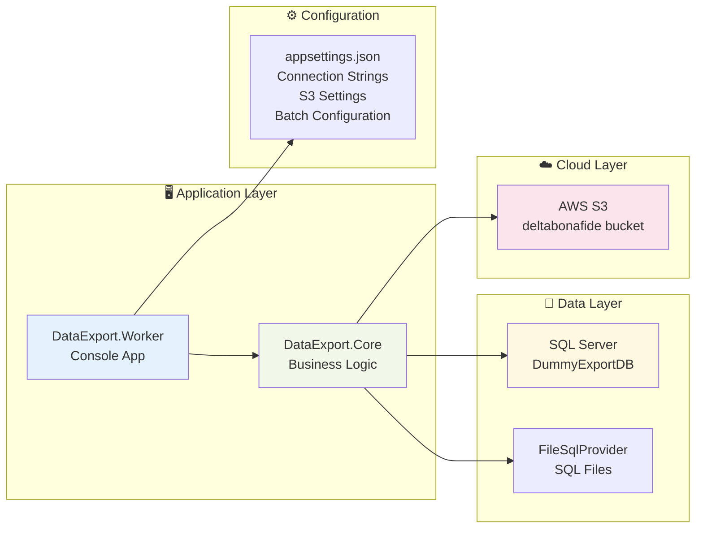

# Data Export Solution - Process Flow Diagram

```mermaid
graph TD
    A[🚀 Start DataExport.Worker] --> B[📖 Load appsettings.json]
    B --> C[🔧 Configure Services<br/>- ExportOptions<br/>- S3 Client<br/>- FileSqlProvider<br/>- ExportService]
    C --> D[🎯 Start Export Process]
    
    D --> E[🔍 Load SQL Files<br/>- count_export_projects.sql<br/>- export_projects_paged.sql]
    E --> F[🗄️ Connect to SQL Server<br/>DummyExportDB]
    F --> G[📊 Get Total Project Count<br/>SELECT COUNT(*) FROM Project]
    G --> H[📐 Calculate Pagination<br/>- Total Pages<br/>- Pages per Batch]
    
    H --> I[🔄 For Each Batch]
    I --> J[📄 For Each Page in Batch]
    
    J --> K[🔍 Execute Paged Query<br/>WITH @Offset, @Limit]
    K --> L[📋 Fetch Project Data<br/>+ Tasks + Documents + Comments<br/>AS JSON]
    L --> M[☁️ Upload to S3<br/>exports/batch_X/projects_page_Y.json]
    M --> N[📝 Log to ExportManifest Table<br/>- BatchNumber<br/>- PageNumber<br/>- S3Key<br/>- Success/Error]
    
    N --> O{More Pages?}
    O -->|Yes| J
    O -->|No| P{More Batches?}
    P -->|Yes| I
    P -->|No| Q[✅ Export Complete]
    
    subgraph "🗄️ Database Tables"
        DB1[Project]
        DB2[Task]
        DB3[Document]
        DB4[DocumentComment]
        DB5[ExportManifest]
    end
    
    subgraph "☁️ AWS S3 Bucket"
        S3A[exports/batch_1/projects_page_1.json]
        S3B[exports/batch_1/projects_page_2.json]
        S3C[exports/batch_2/projects_page_3.json]
        S3D[...]
    end
    
    subgraph "📁 Configuration Files"
        CFG1[appsettings.json]
        CFG2[count_export_projects.sql]
        CFG3[export_projects_paged.sql]
        CFG4[create_export_manifest_table.sql]
    end
    
    K --> DB1
    K --> DB2
    K --> DB3
    K --> DB4
    N --> DB5
    M --> S3A
    M --> S3B
    M --> S3C
    
    style A fill:#e1f5fe
    style Q fill:#c8e6c9
    style M fill:#fff3e0
    style N fill:#f3e5f5
```

## Architecture Overview

