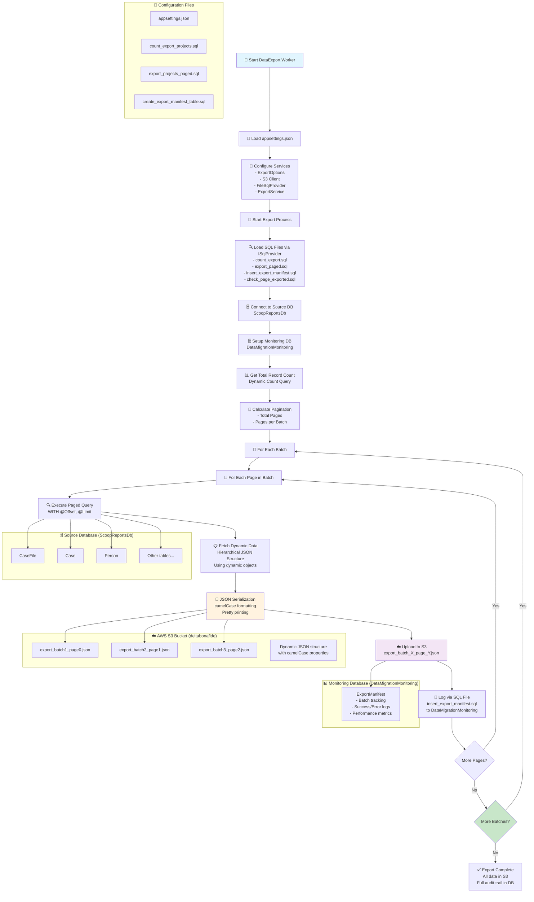
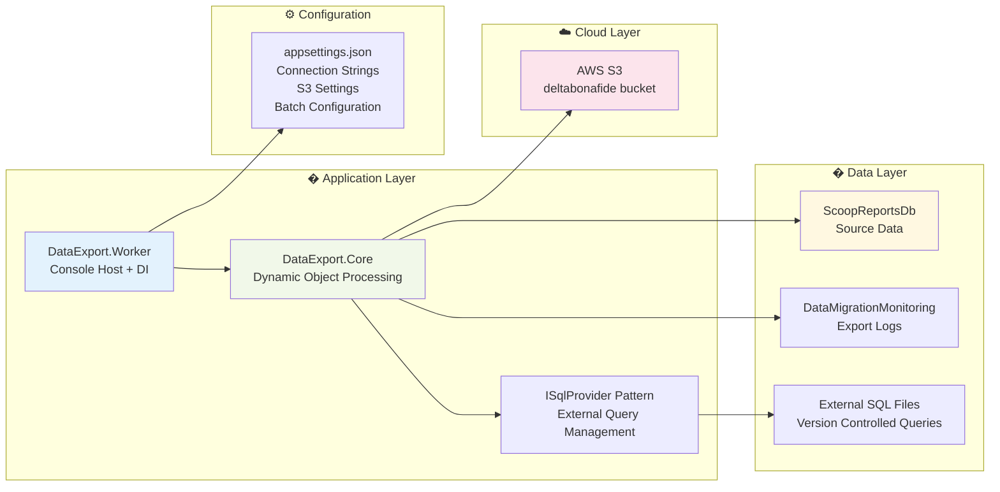

# Data Export Solution - Process Flow Diagram

```mermaid
graph TD
    A[🚀 Start DataExport.Worker] --> B[📖 Load appsettings.json]
    B --> C[🔧 Configure Services<br/>- ExportOptions<br/>- S3 Client<br/>- FileSqlProvider<br/>- ExportService]
    C --> D[🎯 Start Export Process]
    
    D --> E[🔍 Load SQL Files via ISqlProvider<br/>- count_export.sql<br/>- export_paged.sql<br/>- insert_export_manifest.sql<br/>- check_page_exported.sql]
    E --> F[🗄️ Connect to Source DB<br/>ScoopReportsDb]
    F --> F2[🗄️ Setup Monitoring DB<br/>DataMigrationMonitoring]
    F2 --> G[📊 Get Total Record Count<br/>Dynamic Count Query]
    G --> H[📐 Calculate Pagination<br/>- Total Pages<br/>- Pages per Batch]
    
    H --> I[🔄 For Each Batch]
    I --> J[📄 For Each Page in Batch]
    
    J --> K[🔍 Execute Paged Query<br/>WITH @Offset, @Limit]
    K --> L[📋 Fetch Dynamic Data<br/>Hierarchical JSON Structure<br/>Using dynamic objects]
    L --> M[🔄 JSON Serialization<br/>camelCase formatting<br/>Pretty printing]
    M --> N[☁️ Upload to S3<br/>export_batch_X_page_Y.json]
    N --> O[📝 Log via SQL File<br/>insert_export_manifest.sql<br/>to DataMigrationMonitoring]
    
    O --> P{More Pages?}
    P -->|Yes| J
    P -->|No| Q{More Batches?}
    Q -->|Yes| I
    Q -->|No| R[✅ Export Complete<br/>All data in S3<br/>Full audit trail in DB]
    
    subgraph "🗄️ Source Database (ScoopReportsDb)"
        DB1[CaseFile]
        DB2[Case]
        DB3[Person]
        DB4[Other tables...]
    end
    
    subgraph "📊 Monitoring Database (DataMigrationMonitoring)"
        DB5[ExportManifest<br/>- Batch tracking<br/>- Success/Error logs<br/>- Performance metrics]
    end
    
    subgraph "☁️ AWS S3 Bucket (deltabonafide)"
        S3A[export_batch1_page0.json]
        S3B[export_batch2_page1.json]
        S3C[export_batch3_page2.json]
        S3D[Dynamic JSON structure<br/>with camelCase properties]
    end
    
    subgraph "📁 Configuration Files"
        CFG1[appsettings.json]
        CFG2[count_export_projects.sql]
        CFG3[export_projects_paged.sql]
        CFG4[create_export_manifest_table.sql]
    end
    
    K --> DB1
    K --> DB2
    K --> DB3
    K --> DB4
    N --> DB5
    M --> S3A
    M --> S3B
    M --> S3C
    
    style A fill:#e1f5fe
    style Q fill:#c8e6c9
    style M fill:#fff3e0
    style N fill:#f3e5f5
```

## Architecture Overview

```mermaid
graph LR
    subgraph "� Application Layer"
        A1[DataExport.Worker<br/>Console Host + DI]
        A2[DataExport.Core<br/>Dynamic Object Processing]
        A3[ISqlProvider Pattern<br/>External Query Management]
    end
    
    subgraph "�️ Data Layer"
        D1[ScoopReportsDb<br/>Source Data]
        D2[DataMigrationMonitoring<br/>Export Logs]
        D3[External SQL Files<br/>Version Controlled Queries]
    end
    
    subgraph "☁️ Cloud Layer"
        C1[AWS S3<br/>deltabonafide bucket]
    end
    
    subgraph "⚙️ Configuration"
        CF1[appsettings.json<br/>Connection Strings<br/>S3 Settings<br/>Batch Configuration]
    end
    
    A1 --> A2
    A2 --> A3
    A3 --> D3
    A2 --> D1
    A2 --> D2
    A2 --> C1
    A1 --> CF1
    
    style A1 fill:#e3f2fd
    style A2 fill:#f1f8e9
    style D1 fill:#fff8e1
    style C1 fill:#fce4ec
```